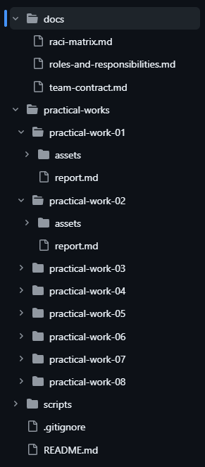
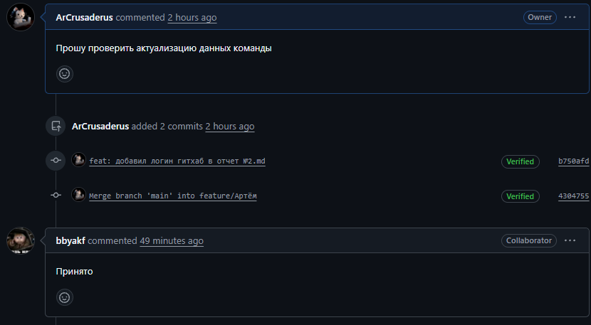
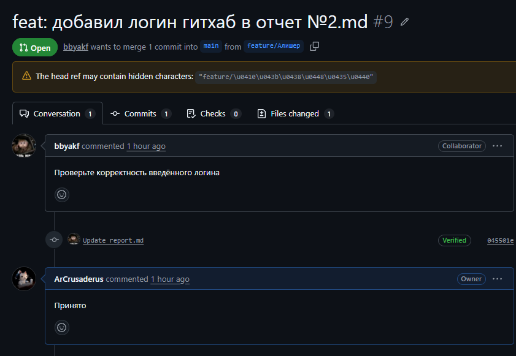
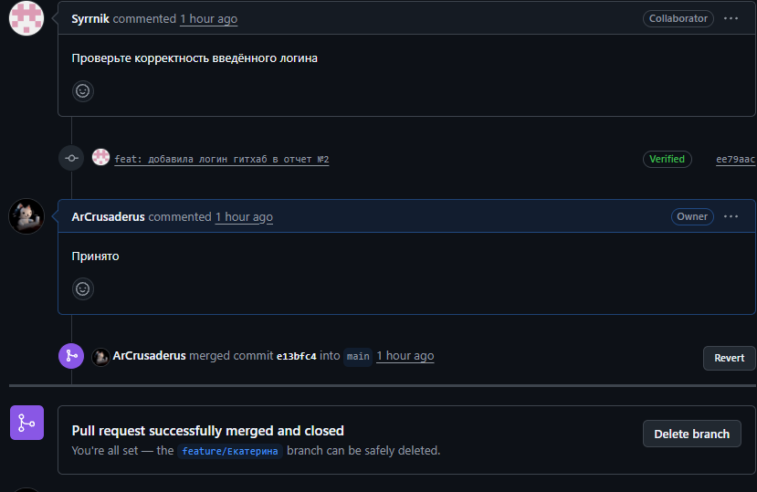
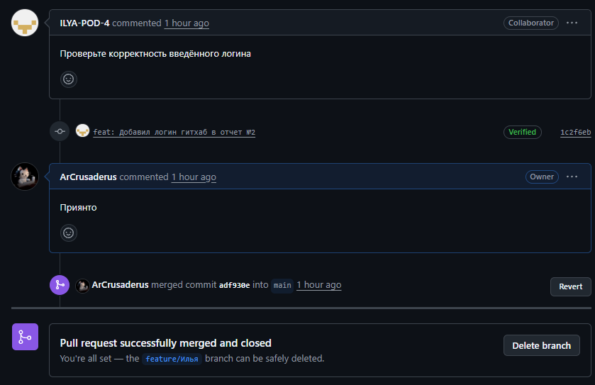
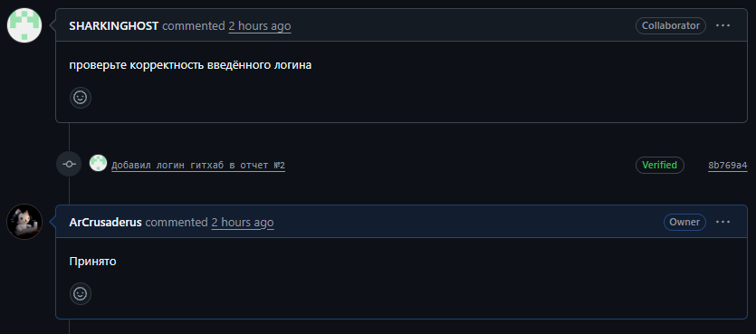

# Отчёт по практической работе №2
## Организация работы с репозиторием проекта и распределение ответственности в Git

**Студент:** Панченко Артём  
**Группа:** 6413  
**Университет:** ФГБОУ ВО «РГРТУ имени В. Ф. Уткина»  
**Дата:** 06.10.2026  

---

### 1. Регистрация участников на GitHub
Все члены команды зарегистрированы на платформе GitHub и добавлены в командный репозиторий:

| Участник | Роль | GitHub логин |
| :--- | :--- | :--- |
| Панченко Артём | Руководитель разработки | @ArCrusaderus |
| Екатерина Папазян | Программист | @Syrrnik |
| Трофим Орлов | Специалист по данным | @SHARKINGHOST |
| Алишер Наврузбеков | Архитектор ПО | @bbyakf |
| Илья Подъяпольский | Специалист по тестированию | @ILYA-POD-4 |

### 2. Ссылка на командный репозиторий
[https://github.com/ArCrusaderus/team-NaXodu-project](https://github.com/ArCrusaderus/team-NaXodu-project)

### 3. Структура репозитория
Репозиторий организован строго по схеме из методических указаний к СР2:

**Описание структуры:**
-   **README.md** — общее описание проекта, состав команды, ссылки на документацию.
-   **docs/** — правила взаимодействия (`team-contract.md`), распределение ролей (`roles-and-responsibilities.md`), матрица RACI (`raci-matrix.md`).
-   **practical-works/** — изолированные папки для каждой из 8 практических работ с подпапками `assets/` и `src/`.
-   **scripts/** — место для вспомогательных скриптов сборки и проверки.
-   **.gitignore** — правила исключения временных и служебных файлов.

### 4. Распределение обязанностей по работе с репозиторием

Обязанности распределены согласно матрице RACI (СР1):

**Руководитель разработки (@ArCrusaderus)** выступает ответственным за результат (A) и исполнителем (R) ключевых инфраструктурных задач: создание и настройка репозитория, поддержание структуры папок, написание отчётов, внесение коммитов, проверка Pull Request, слияние веток (merge) и резервное копирование.

**Архитектор ПО (@bbyakf)** является исполнителем (R) задач по поддержанию структуры папок, написанию отчётов, внесению осмысленных коммитов, проверке Pull Request и резервному копированию. В процессе слияния веток (merge) он выступает информируемым участником (I).

**Остальные участники команды** (@Syrrnik, @SHARKINGHOST, @ILYA-POD-4) являются исполнителями (R) задач по поддержанию структуры, написанию отчётов, внесению коммитов и резервному копированию. В проверке PR и слиянии веток они выступают информируемыми участниками (I).

Полная матрица распределения ролей доступна в файле [docs/raci-matrix.md](../docs/raci-matrix.md).

### 5. История коммитов

История изменений фиксирует вклад каждого участника через осмысленные сообщения коммитов в формате `тип: описание изменения`.

### 6. Pull Request и процесс ревью

Процесс слияния изменений осуществляется через Pull Request для обеспечения проверки кода и соответствия стандартам оформления перед внесением в основную ветку `main`.

### 7. Вывод
Система контроля версий Git позволила организовать параллельную работу команды без риска потери данных и конфликтов. Использование веток `feature/<имя>` и механизма Pull Request обеспечило проверку каждого изменения перед внесением в стабильную версию проекта. История коммитов зафиксировала индивидуальный вклад каждого участника, а строгая структура репозитория упростила навигацию по материалам и проверку результатов преподавателем. Распределение ответственности через
